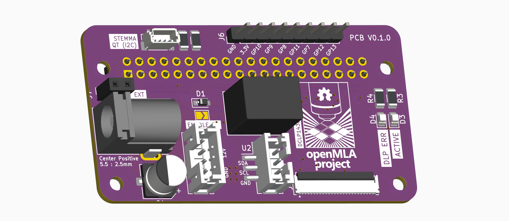

### PCB design

The design is tested with a raspberry pi zero 2, but in principle any Raspberry pi will work. The hardware pins should all be shared, but some changes in raspberry Pi OS may break stuff for newer boards. 

See [the schematic](micromirror-board-controller.pdf) for more info.

### Assembly

Most components are SMD, and the mouser links can be found in the basic [BOM](BOM.csv). In addition to the components of the BOM, you will also need some small wires to connect the USB data lines.

That 51-pin connector is a real pain to solder. For me going with a lower melting point solder and proper board heating made it manageable, but it's not the most enjoyable experience.

### BOM

The prices below include Dutch VAT tax (21%). 

| Description                      | Supplier         | Supplier Part Number | Amount | Total Cost | Comment                                      |
| -------------------------------- | ---------------- | -------------------- | ------ | ---------- | -------------------------------------------- |
| PCB manufacturing                | Aisler           |                      | 3      | 16.16      | MOC 3pcs                                     |
| Raspberry Pi Zero 2              | Mouser           | 358-SC0510           | 1      | 16.9       |                                              |
| Micro SD Card (32GB)             | Kiwi Electronics | TS32GUSDU1           | 1      | 10         | Whatever kind you want would work            |
| Raspberry pi header              | Kiwi Electronics | KW-2639              | 1      | 2          | or any basic, cheaper header                 |
| Raspberry pi header female       | Kiwi Electronics | KW-1650              | 1      | 1.5        |                                              |
| JST SH 4-pin                     | Mouser           | 474-PRT-16766        | 1      | 0.67       | Optional, allows i2c through  stemmaQT/QWIIC |
| Cui DC-DC converter              | Mouser           | 490-P78E05-1000      | 1      | 3.45       |                                              |
| Barreljack                       | Mouser           | 490-PJ-002B          | 1      | 0.79       |                                              |
| Schottky Diode                   | Mouser           | 771-PMEG1020EJ-T/R   | 1      | 0.29       |                                              |
| 100uF capacitor                  | Mouser           | 667-EEE-FN1E101UP    | 1      | 0.57       |                                              |
| 4.7k Ohm pullup resistor         | Mouser           | 667-ERA-8AEB472V     | 2      | 0.87       |                                              |
| 330 Ohm resistor                 | Mouser           | 667-ERA-8AEB331V     | 2      | 0.75       |                                              |
| Green LED                        | Mouser           | 710-150080VS75000    | 1      | 0.22       |                                              |
| Red LED                          | Mouser           | 710-150080RS75000    | 1      | 0.22       |                                              |
| 51-pin FPC connector             | Mouser           | 798-FH35C51S03SHW50  | 1      | 3.52       | not fun to solder                            |
| 3 -pin JST PH connector (10pack) | Mouser           | 485-4389             | 1      | 3.95       | Probably best to find the single-unit part   |
| 4-pin JST PH connector (10pack)  | Mouser           | 485-4390             | 1      | 3.95       | Probably best to find the single-unit part   |
|                                  |                  |                      |        |            |                                              |
| Total                            |                  |                      |        | 65.77      |                                              |

