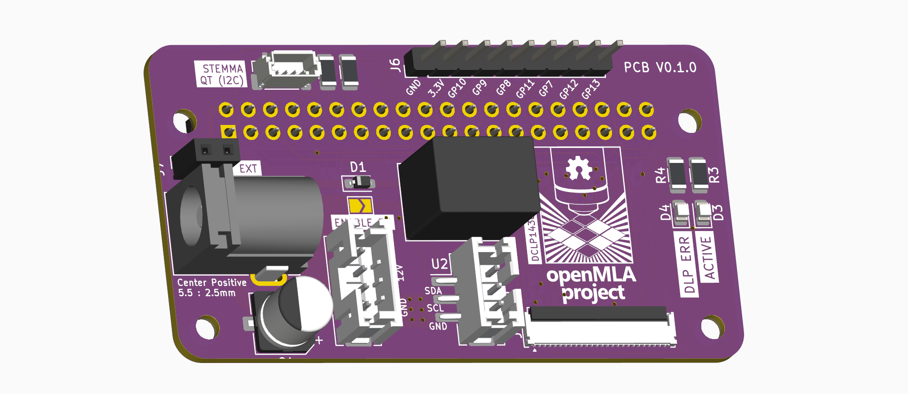

# Photon Ultra DLP controller

This repository contains PCB design files and code to control the UV projector found on the [Anycubic Photon Ultra](https://store.anycubic.com/products/photon-ultra). It also serves as a general example of how to send data to and control the [DCLP1438 DMD controller](https://www.ti.com/product/DLPC1438) through the parallel video interface.

The replacement board allows users to generate the signals required for the *DLP controller board* (designed by eViewTek) & DMD that comes with the photon ultra. It does not capture the full functionality of the Anycubic mainboard as it does not control the interface LCD, control the mechanics (stepper motor) or run any resin 3D printer slicer software. It **only** controls the DLP projector with an arbitrary 8-bit 1280x720 image. Exposure time can be set per image. It is also possible to play video on the projector, if that is something you have a use for. [Video has been tested up to 30Hz](https://github.com/openMLA/photon-ultra-controller/issues/1#issuecomment-2057936067), but should work up to 60Hz.

This project might be of interest to you if you **own a photon ultra** and are interested in either

1. Using the photon ultra for PCB fabrication (use the DLP to expose a photoresist)
2. Are looking to use a DMD for other applications but are not ready to build your own controller board.

If you are interested in learning more about the Photon Ultra, you can find more information on [this photon ultra teardown blog post](https://nemoandrea.github.io/blog/Anycubic_DLP_teardown/). More images are available on request.

> If you have a projector using the DLPC1438 that uses an SPI interface (rather than parallel video), then you can check out the [PCB design and implementation for the Elegoo-mars-4 DLP](https://github.com/openMLA/elegoo-mars-4-dlp-controller) projector.

### PCB

The PCB is designed around the standard 40-pin header present on the main Raspberry pi boards. Have a look at the required pins in the schematic to determine how to implement it for other boards.

The PCB readme also contains a breakdown of parts and cost in the BOM. The total PCB + raspberry pi zero 2 cost is around **65 euro** including tax. 

Keep in mind that you would also need to get your hands on the PCB and UV projector found in an Anycubic Photon Ultra. When it was still being sold in stores, that printer went for around **300 euros**. Second-hand options would be attractive, as the projector is unlikely to be significantly worn or covered in layers of sticky resin. Alternatively you can try contacting eViewTek and source the optical engine and driver board directly.

The PCB has been assembled and verified. Evaluated functionality:

* Powering a Raspberry Pi Zero 2
* Powering the eViewTek board
* software i2c communication (with DLPC1438)
* video display via the parallel interface on the DMD
* Status LED (not currently used in code, but they light up)

Not tested:

* The extra GPIO pins on top (including SPI)
* Stemma QT connection

### Context

This work was developed as part of the [openMLA project](https://github.com/openMLA), where the goal is to build an open hardware lithography system. Eventually an open hardware DLP controller board will be published as part of openMLA, but this represents an intermediate step. 

An earlier attempt at realising the right output format using a rp2040 was partially successful (image display was working), but memory limitations lead to the archiving of that project and the continuation with the current approach, The archived version [is still available](https://github.com/openMLA/photon-ultra-controller-rp2040) for those interested.
