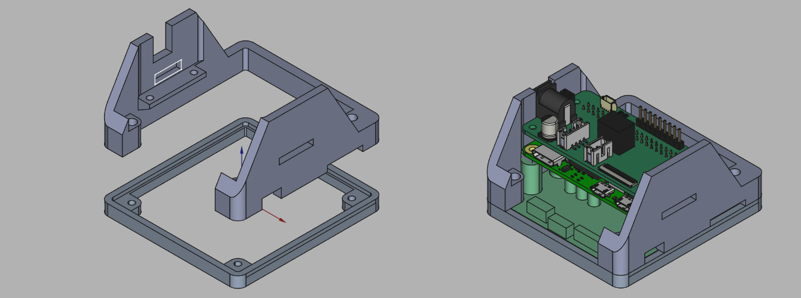
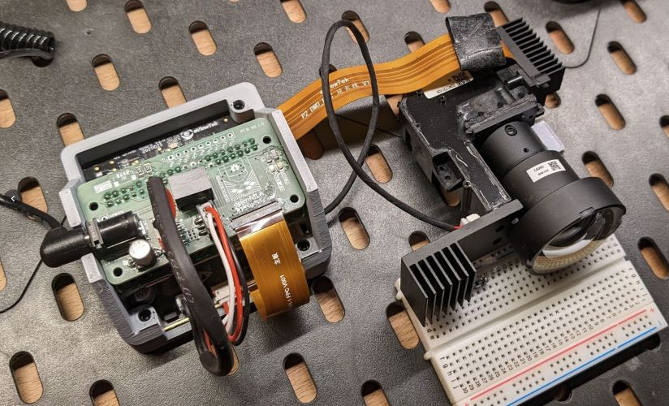

# 3D-printable enclosure 📦

To protect the electronics and keep the raspberry pi board in a good position relative to the eViewTek board, you can 3D-print the basic enclosure that is included in this directory. You will also need 7 10mm M2.5 bolts and screws.

Files were designed in FreeCAD.

### External 3D models

The Model of the raspberry Pi zero 2 was downloaded from [the geekworm wiki](https://wiki.geekworm.com/Raspberry_Pi_Zero_2_W) on 28th of february 2023.